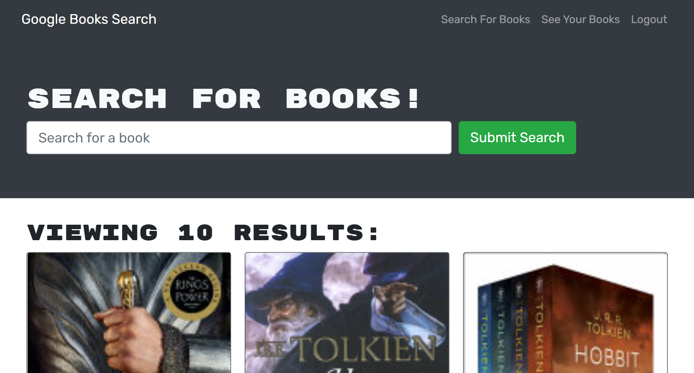

 

# M21 - Book Search Engine

## Description

Book Search Engine is a web app that allows a user to search for books. After searching for said book the user can save a book to their profile for later reference. This app was built in order to practice REACT, GraphQl, and the full MERN Stack. 

While building this project I learned to:
- Deploy a MongoDB database to heroku using MongoDB Atlas
- Structure routes to a database using GraphQl instead of making a RESTful API
- Make front end queries to send information to the back end using GraphQl

### Built With

             

## Table of Contents
- [Installation](#installation)
    - [Screenshot](#screenshot)
- [Usage](#usage)
    - [Website](#website)
    - [Developer](#developer)
- [License](#license)
- [Contact](#contact)

## Installation

Book Search Engine is a deployed web application. Most users must simply navigate to [m21-book-search-engine.herokuapp.com/](https://m21-book-search-engine.herokuapp.com/)

Should you wish to download the project locally you must:

1. Clone the repo down to your local machine.
1. If you don't have Node.js, navigate to [nodejs.org](https://nodejs.org/en/) & download v16.18.0 or newer.
1. Install NPM packages using `npm i`

### Screenshot

(<a href="#readme-top">back to top</a>)

## Usage

This section will describe how to use the website both from a regular users perspective and from a developers perspective. See website and developer sub-sections below.

### Website

As a user you may add notes to the application. It will save your notes to a database so you may leave the page and have the notes stay. 

Should you wish to have access to the text editor on your local device merely hitthe `Install` button at the top left of the screen. All of your notes will carry over.

### Developer

From your terminal, run `npm run start:dev` in order to generate a `dist` folder. You will see that within the dist we have a condensed Progressive Web Application.

In order to see the application at work navigate to [localhost:3000/](http://localhost:3000/) .

(<a href="#readme-top">back to top</a>)

## License

Distributed under the MIT License. See [LICENSE](./LICENSE) for more information.

(<a href="#readme-top">back to top</a>)

## Contact

For any further questions feel free to contact me via:
- GitHub: [Mateo-Wallace](https://github.com/Mateo-Wallace)
- Email: [mateo.t.wallace@gmail.com](mailto:mateo.t.wallace@gmail.com)
- LinkedIn: [Mateo Wallace](https://www.linkedin.com/in/mateo-wallace-57931b254/)

(<a href="#readme-top">back to top</a>)
